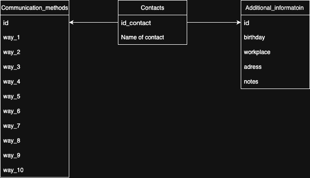

# Database Schema Documentation  

## **Contacts Database Structure**  

  

---

### **Tables Overview**  

#### **1. `contacts`**  
Main table for storing contact information.  

| Field | Type | Description |  
|-------|------|-------------|  
| `id` | `INTEGER` | Primary key, auto-incremented unique identifier. |  
| `name` | `TEXT NOT NULL` | Stores the contact's name (required). |  

---

#### **2. `additional_information`**  
Stores optional details about contacts.  

| Field | Type | Description |  
|-------|------|-------------|  
| `id_contact` | `INTEGER` | Foreign key referencing `contacts(id)`. **Primary key** of this table. |  
| `birthday` | `TEXT` | Contact’s birth date (format: `YYYY-MM-DD`). |  
| `workplace` | `TEXT` | Company or job title. |  
| `address` | `TEXT` | Physical address. |  
| `notes` | `TEXT` | Free-text notes about the contact. |  

**Key Constraint**:  
```sql
FOREIGN KEY (id_contact) REFERENCES contacts(id) ON DELETE CASCADE
```  
*(Deleting a contact automatically removes its additional info.)*  

---

#### **3. `communication_methods`**  
Stores up to 10 communication methods per contact.  

| Field | Type | Description |  
|-------|------|-------------|  
| `id_contact` | `INTEGER` | Foreign key referencing `contacts(id)`. **Primary key** of this table. |  
| `way_1` to `way_10` | `TEXT` | Fields for contact details (e.g., phone, email, social media). |  

**Key Constraint**:  
```sql
FOREIGN KEY (id_contact) REFERENCES contacts(id) ON DELETE CASCADE
```  
*(Deleting a contact removes all linked communication methods.)*  

---

### **Full-Text Search Setup**  
The database includes a virtual table `contacts_fts` for fast name searches:  
```sql
CREATE VIRTUAL TABLE contacts_fts USING fts5(name, content='contacts', content_rowid='id');
```  
**Triggers** synchronize data between `contacts` and `contacts_fts`:  
- `contacts_ai`: Auto-adds new names to the search index.  
- `contacts_au`: Updates the index when names change.  
- `contacts_ad`: Removes deleted contacts from the index.  

---

### **How to Create the Database**  

1. **Save the schema**:  
   Write the SQL code to `schema.sql` (see [schema.sql](#) for the full script).  

2. **Run the command**:  
   ```bash
   sqlite3 contacts.db < schema.sql
   ```  

3. **Verify creation**:  
   ```bash
   sqlite3 contacts.db ".tables"
   ```  
   Expected output:  
   ```
   additional_information  communication_methods   contacts_fts_data     
   contacts                contacts_fts            contacts_fts_config   
   contacts_fts_docsize    contacts_fts_idx
   ```  

4. **Test with sample data**:  
   ```sql
   -- Insert a contact
   INSERT INTO contacts (name) VALUES ('Test User');
   INSERT INTO additional_information VALUES (1, '2000-01-01', 'Test Corp', 'Test City', 'Sample note');
   INSERT INTO communication_methods VALUES (1, '+1234567890', 'test@example.com', NULL, NULL, NULL, NULL, NULL, NULL, NULL, NULL);

   -- Search (matches "Test")
   SELECT * FROM contacts_fts WHERE name MATCH 'Test*';
   ```  

**Attachments**:  
- [schema.png](schema.png) (Schema diagram)  
- [schema.sql](schema.sql) (Full SQL script)