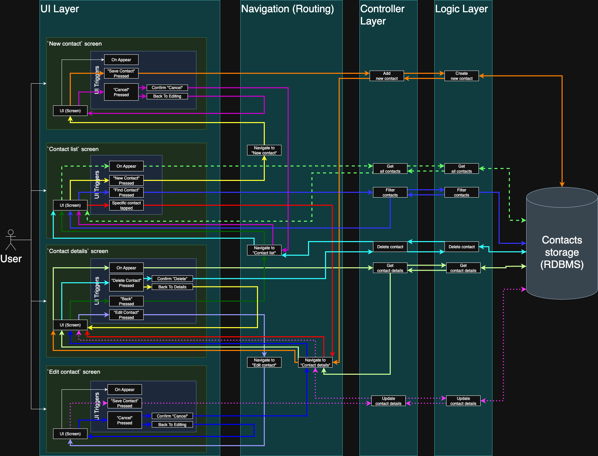

# Project Architecture

This document describes the architecture of the project and high-level details about how the application works.

## Overview

The application is built using a layered architecture. This approach separates the application's concerns into distinct layers, where each layer has a unique responsibility. This separation improves maintainability, allows for independent development and testing of each part, and makes the overall system easier to understand and scale.

The layers are:
- **UI Layer:** Renders UI elements and handles all interaction from a user (touches, clicks, keyboard input). This layer contains all components dependent on a specific UI framework. It holds `UI triggers` which initiate logic and/or navigation events.
- **Controller Layer + Navigation:** Acts as an intermediary, connecting the `UI` and `Logic` layers. It processes requests from the UI, calls the appropriate business logic, and returns the results to the UI for display. Navigation is responsible for routing between screens based on events in the app (e.g., database updates or user interactions).
- **Logic Layer:** Contains the core business logic and data entities of the application. It communicates with the database to perform CRUD (Create, Read, Update, Delete) operations. The database is a relational SQLite database with full-text search capabilities to meet feature requirements.

## Architecture Scheme

See the high-level architecture diagram below:

The diagram shows both the data flow (how data is passed between layers) and the navigation flow (dependencies between UI views). To improve readability, the flow for each specific use case is colored uniquely.

If you need to edit or update the architecture diagram, use the [`draw.io`](https://draw.io) service and the [raw XML file](./architecture.drawio).

## Use Cases and Flows

The sections below contain descriptions and details for specific use cases. This information accompanies the scheme and should be used as a helper to the visual diagram above.

### Navigation

This subsection describes the relationships between UI views (screens) and their dependencies.

- Upon opening, the app shows the “Contact List” screen.
- Description of the navigation flow for opening the app (follow dashed light green arrows on the scheme):
    - **Pre-requisites:** The app is launched.
    - **Action (trigger):** The application finishes loading.
    - **Result:** The `"Contact List"` screen is displayed.
- Description of the navigation flow for closing the app:
    - **Pre-requisites:** The app is open.
    - **Action (trigger):** The user performs a system action to close the app (e.g., swipes it away from the recent apps list).
    - **Result:** The application process is terminated.
- Description of the navigation flow for opening the contact editing screen (follow light purple arrows on the scheme):
    - **Pre-requisites:** The user is on the `"Contact Details"` screen.
    - **Action (trigger):** The user presses the `"Edit Contact"` button.
    - **Result:** Navigate to the `"Edit Contact"` screen, which shows a form pre-filled with the current contact's data.
- Description of the navigation flow for returning to the contact list (follow green arrows on the scheme):
    - **Pre-requisites:** The user is on the `"Contact Details"` screen.
    - **Action (trigger):** The user presses the `"Back"` button.
    - **Result:** Navigate to the `"Contact List"` screen.
- Description of the navigation flow for adding a new contact (follow yellow arrows on the scheme):
    - **Pre-requisites:** The user is on the `"Contact List"` screen.
    - **Action (trigger):** The user presses the `"Create New Contact"` button.
    - **Result:** Navigate to the `"New Contact"` screen with empty input fields.
- Description of the navigation flow for canceling the creation of a new contact (follow purple arrows on the scheme):
    - **Pre-requisites:** The user is on the `"New Contact"` screen.
    - **Action (trigger):** The user presses the `"Cancel"` button and confirms the action.
    - **Result:** Navigate back to the `"Contact List"` screen.
- Description of the navigation flow for viewing a newly created contact (follow orange arrows on the scheme):
    - **Pre-requisites:** The user is on the `"New Contact"` screen and has filled in the required fields.
    - **Action (trigger):** The user presses the `"Save Contact"` button.
    - **Result:** After the data is saved, navigate to the `"Contact Details"` screen to show the information for the newly created contact.
- Description of the navigation flow for viewing a specific contact's details (follow red arrows on the scheme):
    - **Pre-requisites:** The user is on the `"Contact List"` screen.
    - **Action (trigger):** The user taps on a specific contact in the list.
    - **Result:** Navigate to the `"Contact Details"` screen to show all stored information for the selected contact.
- Description of the navigation flow for deleting a contact (follow light blue arrows on the scheme):
    - **Pre-requisites:** The user is on the `"Contact Details"` screen.
    - **Action (trigger):** The user presses the `"Delete Contact"` button and confirms the deletion.
    - **Result:** Navigate to the `"Contact List"` screen. The list is updated and no longer shows the deleted contact.
- Description of the navigation flow for canceling the deletion of a contact (follow yellow arrows on the scheme):
    - **Pre-requisites:** The user has pressed the `"Delete Contact"` button on the `"Contact Details"` screen, and a confirmation dialog is shown.
    - **Action (trigger):** The user presses the button to cancel the deletion (e.g., `"Cancel"` or `"No"`).
    - **Result:** The confirmation dialog is dismissed, and the user remains on the `"Contact Details"` screen.
- Description of the navigation flow for saving an updated contact (follow dashed magenta arrows on the scheme):
    - **Pre-requisites:** The user is on the `"Edit Contact"` screen and has changed some information.
    - **Action (trigger):** The user presses the `"Save Contact"` button.
    - **Result:** After the data is saved, navigate to the `"Contact Details"` screen to show the updated information.
- Description of the navigation flow for canceling an update (follow dark blue arrows on the scheme):
    - **Pre-requisites:** The user is on the `"Edit Contact"` screen.
    - **Action (trigger):** The user presses the `"Cancel"` button and confirms the action.
    - **Result:** Navigate back to the `"Contact Details"` screen without saving any changes.

### Data Flow

This subsection describes how data is passed between layers and components. The following data models are used, which directly correspond to the database schema.

CommunicationMethod struct:
- id_contact (Integer)
- type (String)
- value (String)

ContactFullDetails struct:
- id_contact (Integer)
- name (String)
- birthday (String, format "YYYY-MM-DD")
- workplace (String)
- address (String)
- notes (String)

ContactShortDetails struct:
- id_contact (Integer)
- name (String)

- Description of the data flow for displaying all contacts (follow dashed light green arrows on the scheme):
    - **Pre-requisites:** The user navigates to the “Contact List” screen.
    - **Action (trigger):** The "Contact List" screen appears.
    - **Result:**
        - The UI calls the `GetAllContacts() -> [ContactShortDetails]` method in the controller layer.
        - The logic layer performs a `SELECT id_contact, name FROM contacts ORDER BY name ASC` operation on the database.
        - The logic layer maps the results to an array of `ContactShortDetails` structs and returns it.
        - The UI layer receives the data and displays the list of contacts or shows a "No contacts" message if the array is empty.

- Description of the data flow for creating a new contact (follow orange arrows on the scheme):
    - **Pre-requisites:** The user is on the "New Contact" screen.
    - **Action (trigger):** The user fills out the form and presses the “Save Contact” button.
    - **Result:**
        - The UI layer gathers the data into a `ContactFullDetails` object.
        - The UI calls the `AddNewContact(ContactFullDetails)` method in the controller.
        - The logic layer validates the data and performs `INSERT` operations: first into the `contacts` table to get a new `id_contact`, then into `contact_details` and `communication_methods` tables with that new ID.
        - The logic layer returns the complete `ContactFullDetails` object, which is then passed to the UI for display on the "Contact Details" screen.

- Description of the data flow for viewing contact details (follow lime or light green arrows on the scheme):
    - **Pre-requisites:** The user is on the "Contact List" screen.
    - **Action (trigger):** The user taps on a contact.
    - **Result:**
        - The UI layer gets the `id_contact` of the selected item.
        - The UI calls the `GetContactDetails(id_contact)` method in the controller.
        - The logic layer performs `SELECT` operations across the `contacts`, `contact_details`, and `communication_methods` tables for the given `id_contact`.
        - The logic layer assembles the data into a single `ContactFullDetails` struct and returns it.
        - The UI layer receives the object and displays its data on the "Contact Details" screen.

- Description of the data flow for finding contacts by name (follow blue arrows on the scheme):
    - **Pre-requisites:** The user is on the "Contact List" screen.
    - **Action (trigger):** The user types a search query into the search field.
    - **Result:**
        - With each change, the UI calls `FilterContacts(searchQuery)` in the controller.
        - The logic layer performs a `SELECT id_contact, name FROM contacts_fts WHERE name MATCH 'searchQuery*'` operation.
        - The results are returned as an array of `ContactShortDetails` and displayed in the UI.

- Description of the data flow for updating a contact (follow dashed magenta arrows on the scheme):
    - **Pre-requisites:** The user is on the "Edit Contact" screen.
    - **Action (trigger):** The user modifies the form and presses the “Save Contact” button.
    - **Result:**
        - The UI layer gathers all data into a `ContactFullDetails` object.
        - The UI calls the `UpdateContact(ContactFullDetails)` method in the controller.
        - The logic layer performs `UPDATE` operations on the `contacts`, `contact_details`, and `communication_methods` tables based on the `id_contact`. This may involve deleting old communication methods and inserting new ones.
        - The updated `ContactFullDetails` object is returned and displayed on the "Contact Details" screen.

- Description of the data flow for removing a contact (follow light blue arrows on the scheme):
    - **Pre-requisites:** The user is on the "Contact Details" screen.
    - **Action (trigger):** The user presses the “Delete Contact” button and confirms the action.
    - **Result:**
        - The UI layer gets the `id_contact` of the current contact.
        - The UI calls the `DeleteContact(id_contact)` method in the controller.
        - The logic layer performs a `DELETE FROM contacts WHERE id_contact = ?` operation.
        - Due to the `ON DELETE CASCADE` constraint in the database schema, all related records in `contact_details` and `communication_methods` are automatically deleted.
        - The app navigates to the "Contact List" screen, which refreshes to show the updated list.