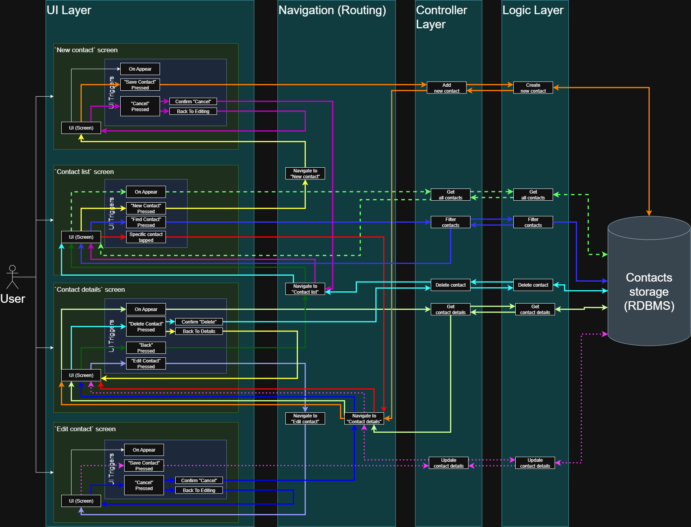

# Project Architecture

This document outlines the architecture for the project and provides high-level details about the system\'s design.

## Overview

The application will be developed using a layered architecture. This approach separates the application's concerns into three distinct layers, each with a unique responsibility. This separation is chosen to improve maintainability, allow for independent development and testing of each part, and make the overall system easier to understand as it grows.

The app is cut into 3 layers:
- **UI Layer:** Renders UI elements and handles all user interaction (touches, clicks, keyboard input). This layer will contain all components dependent on a specific UI framework and will hold UI triggers that initiate logic and/or navigation events. You can see the triggers in the high-level diagram below.
- **Controller Layer and the Navigation:** Acts as an intermediary, connecting the `UI` and `Logic` layers. It processes requests from the UI, calls the appropriate business logic, and returns the results to the UI for display. Navigation is responsible for routing between screens based on events in the app.
- **Logic Layer:** Contains the core business logic and data entities. It will communicate with the database to perform CRUD (Create, Read, Update, Delete) operations. The database is a relational database with a full-text search capabilities.

## Architecture Scheme

See the high-level architecture diagram below:

The scheme shows both the data flow (how data is passed between layers) and the navigation flow (dependencies between UI views). To improve readability, the flow for each specific use case is colored uniquely.

If you need to edit or update the architecture scheme (diagram), use the [`draw.io`](https://draw.io) service and the [raw XML file](./architecture.drawio).

## Use Cases and Flows

The sections below contain descriptions for specific use cases. This information accompanies the scheme and should be used as a reference for the visual diagram above.

### Navigation

This subsection describes the relationships between UI views (screens) and their dependencies. Each item is a description of the navigation flow for opening 

- Upon opening, the app shows the `Contact List` screen.
- App can be closed from any screen.
- Opening the `Edit contact` screen (follow light lavender arrows on the scheme):
    - Pre-requisites: The user is on the `Contact Details` screen.
    - Action (trigger): The user presses the `Edit Contact` button.
    - Result: Navigate to the `Edit Contact` screen, which shows a details for the chosen contact that can be edit.
- Returning back to the contact list from the `Contact Details` (follow green arrows on the scheme):
    - Pre-requisites: The user is on the `Contact Details` screen.
    - Action (trigger): The user presses the `Back` button.
    - Result: Navigate to the `Contact List` screen.
- Adding a new contact (follow yellow arrows on the scheme):
    - Pre-requisites: The user is on the `Contact List` screen.
    - Action (trigger): The user presses the `New Contact` button.
    - Result: Navigate to the `New Contact` screen with empty input fields.
- Canceling the creation of a new contact (follow purple arrows on the scheme):
    - Pre-requisites: The user is on the `New Contact` screen.
    - Action (trigger): The user presses the `Cancel` button and confirms the action.
    - Result: Navigate back to the `Contact List` screen.
- Viewing a newly created contact (follow orange arrows on the scheme):
    - Pre-requisites: The user is on the `New Contact` screen and has filled in the required fields.
    - Action (trigger): The user presses the `Save Contact` button.
    - Result: After the data is saved, navigate to the `Contact Details` screen and show the information for the newly created contact.
- Viewing a specific contact\'s details (follow red arrows on the scheme):
    - Pre-requisites: The user is on the `Contact List` screen.
    - Action (trigger): The user taps on a specific contact in the list.
    - Result: Navigate to the `Contact Details` screen to show all stored information for the selected contact.
- Deleting a contact (follow light blue arrows on the scheme):
    - Pre-requisites: The user is on the `Contact Details` screen.
    - Action (trigger): The user presses the `Delete Contact` button and confirms the deletion.
    - Result: After the deletion, navigate to the `Contact List` screen. The list is updated and no longer shows the deleted contact.
- Canceling the deletion of a contact (follow yellow arrows on the scheme):
    - Pre-requisites: `Contact details` is shown, a confirmation dialog for deletion is shown.
    - Action (trigger): The user presses the button to cancel the deletion.
    - Result: The confirmation dialog is dismissed, and the user see the `Contact Details` screen.
- Updating and saving the contact (follow dashed magenta arrows on the scheme):
    - Pre-requisites: The user is on the `Edit Contact` screen and has changed some information.
    - Action (trigger): The user presses the `Save Contact` button.
    - Result: After the data is saved, navigate to the `Contact Details` screen to show the updated information.
- Canceling the update of the contact (follow dark blue arrows on the scheme):
    - Pre-requisites: The user is on the `Edit Contact` screen.
    - Action (trigger): The user presses the `Cancel` button and confirms the action.
    - Result: Navigate back to the `Contact Details` screen without saving any changes.
- Canceling process of the cancellation of the edit (follow dark blue arrows on the scheme):
    - Pre-requisites: `Edit Contact` is shown, a confirmation dialog for cancel is shown.
    - Action (trigger): The user presses the `Back` button and cancel the action.
    - Result: Navigate back to the `Edit Contact` screen without saving any changes.

### Data Flow

This subsection describes how the data is passed between layers and components.

#### Data Models

The following data models is being used to pass the data between components.

- `CommunicationMethod` struct:
    - id_contact (Integer)
    - type (String)
    - value (String)

- `ContactFullDetails` struct:
    - id_contact (Integer)
    - name (String)
    - birthday (String)
    - workplace (String)
    - address (String)
    - notes (String)
    - details ([CommunicationMethod])

- `ContactShortDetails` struct:
    - id_contact (Integer)
    - name (String)

#### Data Flow Descriptions

- Display all contacts (follow dashed light green arrows on the scheme):
    - Pre-requisites: The user is on the `Contact List` screen.
    - Flow:
	- The `Contact List` screen appears.
        - The UI calls a method in the controller to get all contacts.
	- The controller passes the request to the logic layer (calls the method from the logic layer).
	- The logic layer makes a request to the storage.
	- The storage retrieves all stored contacts and returns as a sorted list.
	- The logic layer recieves the data from the storage and converts it to the list of `ContactShortDetails`.
	- The controller receives the list of `ContactShortDetails`.
        - The UI layer receives the data and displays the list of contacts or a "No contacts" message.
- Description of the data flow for creating a new contact (follow orange arrows on the scheme):
    - Pre-requisites: The user is on the `New Contact` screen.
    - Flow:
	- The UI calls a method in controller to add new contact.
	- The controller passes the request to the logic layer (calls the method from the logic layer).
	- The logic layer validates data and makes a request to the storage.
	- The storage retrieves information about successful/unsuccessfull saving of new instance.
	- The logic layer receives the information and passes it to controller layer.
	- The UI layer navigates user to `Contact list` screen and displays message about how saving was made.
- Description of the data flow for viewing contact details (follow lime or light green arrows on the scheme):
    - Pre-requisites: The `Contact details` screen appears.
    - Flow:
	- The UI calls a method in controller to get specific contact. 
	- The controller passes the request to the logic layer (calls the method from the logic layer).
	- The logic layer makes a request to the storage.
	- The storage retrieves specific contact and returns as single entity.
	- The logic layer receives the data from the storage and converts it to the `ContactFullDetails` object.
	- The controller receives the object of `ContactFullDetails`.
	- The UI layer receives the data and displays the specific information about the contact.
- Description of the data flow for finding contacts by name (follow blue arrows on the scheme):
    - Pre-requisites: The user triggers `Find Contact`.
    - Flow:
	- The UI calls a method in controller to filter contacts.
	- The controller passes the request to the logic layer (calls the method from the logic layer).
	- The logic layer makes a request to the storage.
	- The storage retrieves all stored contacts, that fit to the request string and returns as a sorted list.
	- The logic layer recieves the data from the storage and converts it to the list of `ContactShortDetails`.
	- The controller receives the list of `ContactShortDetails`.
        - The UI layer receives the data and displays the list of contacts or a "No contacts" message.
- Description of the data flow for updating a contact (follow dashed magenta arrows on the scheme):
    - Pre-requisites: The user triggers "Save Contact".
    - Flow: 
	- The UI calls a method in controller to update contact.
	- The controller passes the request to the logic layer.
	- The logic layer makes a request to the storage.
	- The storage retrieves information about successful/unsuccessfull updating of new instance.
	- The logic layer receives the information and passes it to controller layer.
	- The UI layer navigates user to `Contact details` screen and displays message about how updating was made.
- Description of the data flow for removing a contact (follow light blue arrows on the scheme):
    - Pre-requisites: The user triggers "Delete Contact".
    - Flow:
	- The UI wait a confirmation to delete a contact.
	- If user is agree, the UI calls method in controller to delete the contact.
	- The logic layer makes a request to the storage.
	- The storage retrieves information about successful/unsuccessfull deleting of new instance.
	- The logic layer receives the information and passes it to controller layer.
	- The UI layer navigates user to `Contact list` screen and displays message about deleting status.
